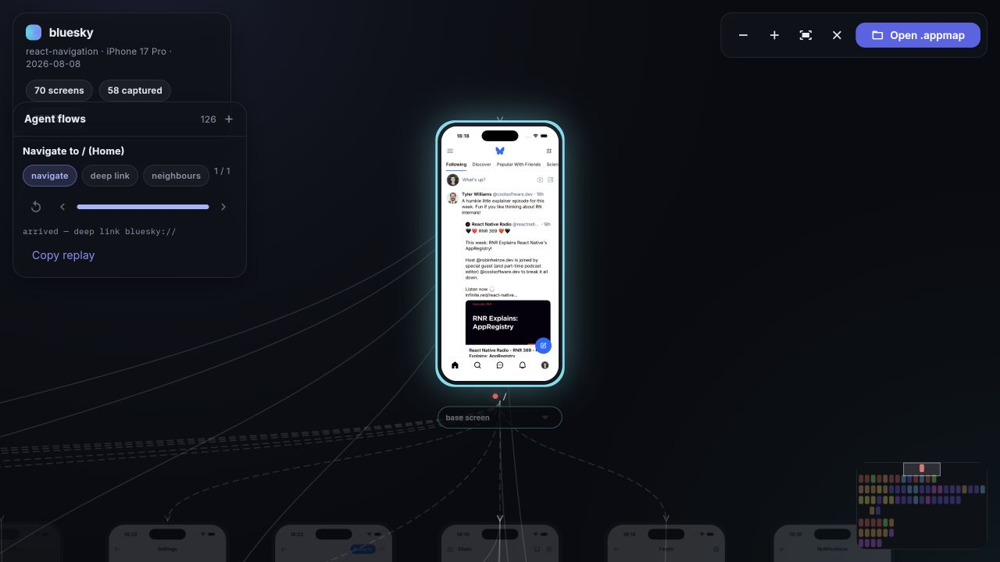

# flutter-design-map-skills

A Flutter agent skill and toolchain that produces a **visual navigation map of
a Flutter app**: every route as a card with a real screenshot, runtime state
variants such as sheets and dialogs, navigation edges between screens, and
replayable [Argent](https://argent.swmansion.com) flows showing how each screen
was reached.

The result is packaged as a portable, producer-neutral `.appmap` bundle
compatible with [expo-map](https://github.com/aleqsio/expo-map), and can be
explored in the included interactive Flutter visualiser.

## How it works

```
┌──────────────┐     ┌───────────────────┐     ┌────────────┐     ┌──────────────┐
│ 1. parse     │ ──▶ │ 2. explore        │ ──▶ │ 3. pack    │ ──▶ │ 4. visualise │
│ Flutter code │     │ simulator/emulator│     │ .appmap zip│     │ Flutter web  │
└──────────────┘     └───────────────────┘     └────────────┘     └──────────────┘
 routes, edges,       screenshots, states,      manifest, map,     graph, flows,
 params, state hints  navigation flows          screens, flows     replay overlays
```

1. **Parse:** statically inspect GoRouter, go_router_builder, AutoRoute,
   Navigator 1.0, or Navigator 2.0 code to discover routes, parameters,
   navigation edges, deep-link schemes, and runtime-state hints.
2. **Explore:** open each route on an iOS Simulator or Android emulator,
   capture what really rendered, classify redirects and failures, trigger safe
   runtime states, and record navigation paths as Argent flows.
3. **Pack:** merge the graph, capture verdicts, screenshots, state variants,
   and replay metadata into an expo-map-compatible `.appmap` archive.
4. **Visualise:** inspect the graph, distinguish code-declared and
   agent-observed edges, follow recorded flows, and review interaction markers
   on the exact captured screen state.

## Visualiser (Flutter web)

**Hosted visualiser:**
[flutter-map-visualiser.onrender.com](https://flutter-map-visualiser.onrender.com/)

To run it locally:

```bash
cd apps/flutter_map_visualiser
flutter pub get
flutter run -d chrome
```

The bundled Bluesky demo opens automatically with 70 routes, 126 flows, and 85
screenshots, including 15 runtime-state variants. Of its 70 base captures, 58
are healthy screens or intentional empty states; the remaining captures
document loading, not-found, error-boundary, and auth-wall outcomes.

Open an `.appmap` from `.flutter-map/`—or any expo-map-compatible bundle—to
replace the demo. Pan and zoom the graph, inspect solid code-declared and
dashed agent-observed edges, follow flow playback with tap/swipe overlays,
switch captured screen states, isolate one-action neighbours, jump through the
minimap, and copy replay commands. Bundle contents are parsed locally in the
browser and are not uploaded.



*The bundled Bluesky map with its Home route selected, connected navigation
edges, replay controls, and graph minimap.*

## Quick start

```bash
cd packages/flutter_map_parser
dart pub get
dart test

# parse + pack (static, no simulator)
dart run bin/flutter_map.dart ../../fixtures/demo_go_router

# parse + prepare deep-link explore stubs
dart run bin/prepare_explore.dart ../../fixtures/demo_go_router
```

## Agent skill

The `flutter-design-map-skills` skill can run the complete mapping workflow for another
Flutter project: parse its routes, prepare deep links, capture screens and
runtime states on a simulator or emulator, record navigation flows, and package
the result as an expo-map-compatible `.appmap` bundle.

**The skill runs only when you ask for it by name** — `/flutter-design-map-skills`.
It sets `disable-model-invocation: true`, so the agent will not start it on its
own no matter how the conversation drifts, and nothing is injected into sessions
that did not ask for it. That is deliberate: the workflow boots a simulator and
sweeps every route in the app, which is not something to trigger by accident.

It needs the Dart SDK on `PATH` — the workflow drives the parser CLIs in
`packages/flutter_map_parser`, which ship with every install method below.

### Install

Install separately for each harness you use. Every method points at the same
`skills/` directory, so updating is always "pull the latest."

| Harness | Install | Where to run it |
|---------|---------|-----------------|
| [Claude Code](#claude-code) | `/plugin marketplace add OmarAly92/flutter-design-map` then `/plugin install flutter-map@flutter-design-map-skills` | inside a Claude Code session |
| [Codex](#codex) | `codex plugin marketplace add OmarAly92/flutter-design-map` then `codex plugin add flutter-map@flutter-design-map-skills` | your OS terminal |
| [Gemini CLI](#gemini-cli) | `gemini extensions install https://github.com/OmarAly92/flutter-design-map` | your OS terminal |
| [OpenCode](#opencode) | add the plugin to `opencode.json` | config file |
| [Pi](#pi) | `pi package add github:OmarAly92/flutter-design-map` | your OS terminal |
| [Cursor / Kimi](#cursor--kimi) | add the repo in the plugin manager | harness UI |
| [Anything else](#any-other-agent-universal-fallback) | `./install.sh` from a clone | your OS terminal |

#### Claude Code

Run both inside a Claude Code session — the first registers the marketplace, the
second installs the plugin from it:

```bash
/plugin marketplace add OmarAly92/flutter-design-map
```

```bash
/plugin install flutter-map@flutter-design-map-skills
```

To update, refresh the marketplace metadata first, then reinstall:

```bash
/plugin marketplace update flutter-design-map-skills
```

```bash
/plugin install flutter-map@flutter-design-map-skills
```

#### Codex

Run both in your OS terminal — **not** inside an active Codex chat session
(`/plugins` there only browses what is already installed):

```bash
codex plugin marketplace add OmarAly92/flutter-design-map
```

```bash
codex plugin add flutter-map@flutter-design-map-skills
```

Then start a new Codex session. It reads `.codex-plugin/plugin.json`, which
registers `./skills/`. Re-run both commands to update.

#### Gemini CLI

```bash
gemini extensions install https://github.com/OmarAly92/flutter-design-map
```

Update:

```bash
gemini extensions update flutter-map
```

#### OpenCode

Add to your `opencode.json`:

```json
{
  "plugin": ["flutter-map@git+https://github.com/OmarAly92/flutter-design-map.git"]
}
```

See [`.opencode/INSTALL.md`](./.opencode/INSTALL.md) for details.

#### Pi

```bash
pi package add github:OmarAly92/flutter-design-map
```

#### Cursor / Kimi

Add this repo through the harness's plugin manager. Each reads its own manifest
— `.cursor-plugin/plugin.json`, `.kimi-plugin/plugin.json` — which registers
`./skills/`.

#### Any other agent (universal fallback)

For any agent that reads `SKILL.md` files from `~/.claude/skills/`:

```bash
git clone https://github.com/OmarAly92/flutter-design-map.git
```

```bash
cd flutter-design-map && ./install.sh
```

This symlinks the skill into `~/.claude/skills/` (override with
`CLAUDE_SKILLS_DIR=/path ./install.sh`) and fetches the parser's dependencies.
The symlink matters: the skill resolves the parser package by walking up from
its own real path. Update with `git pull` and re-run `./install.sh`.

Start a new agent session after installing so the skill is discovered.

### Use

Open the Flutter project you want to map, then invoke the skill by name — it
will not start on its own:

```text
/flutter-design-map-skills
```

You can supply a project path or limit how far the workflow runs:

```text
/flutter-design-map-skills /path/to/my_flutter_app
/flutter-design-map-skills --prepare
/flutter-design-map-skills --static
```

| Mode | Result |
|------|--------|
| default | Full parse, simulator/emulator capture, flow recording, and packaging |
| `--prepare` | Parse routes and write the exploration plan and deep-link flow stubs, then stop |
| `--static` | Parse and package without launching a simulator; captures are marked missing |

On Codex, `$flutter-design-map-skills` works as the invocation form. On Gemini
CLI there is no slash command — the workflow is in context from `GEMINI.md`, so
ask for a navigation map explicitly.

For the best full capture, boot an iOS Simulator or Android emulator first,
configure a working deep-link scheme, and make safe fixture or test data
available for parameterized and authenticated routes. When native devices are
unavailable, the skill can use its more limited browser-capture fallback.

### Output

All generated files stay inside the mapped Flutter project:

```text
.flutter-map/
├── graph.json
├── explore-plan.json
├── capture-status.json
├── screens/
├── flows/
├── map.html
└── <app-name>-<date>.appmap
```

Open the final `.appmap` with the Flutter visualiser above, or open `map.html`
for a self-contained review. Consider adding `.flutter-map/` to the target
project's `.gitignore`.

See [`skills/flutter-design-map-skills/SKILL.md`](skills/flutter-design-map-skills/SKILL.md) for the full
capture procedure and safety rules.

## Replay a flow

Flows are stored as runnable Argent YAML with a cartography metadata sidecar.
Replay one against a running simulator or emulator with:

```bash
npx @swmansion/argent flow run \
  .flutter-map/flows/<flow-name>.yaml
```

Legacy JSON flows can be migrated once:

```bash
dart run packages/flutter_map_parser/bin/convert_flows.dart \
  /path/to/flutter-project --delete-v1
```

## Repository layout

- `skills/flutter-design-map-skills/` — agent orchestration, capture phases, and safety rules
- `packages/flutter_map_parser/` — route parser, explore-plan generator,
  renderer, flow converter, and `.appmap` packer
- `apps/flutter_map_visualiser/` — Flutter web visualiser and bundled Bluesky
  demonstration map
- `docs/appmap-format.md` — versioned `.appmap` and Argent sidecar contract
- `fixtures/` — minimal apps covering every supported Flutter routing mode
- `.claude-plugin/`, `.codex-plugin/`, `.cursor-plugin/`, `.kimi-plugin/`,
  `.agents/`, `.opencode/`, `.pi/`, `gemini-extension.json` — per-harness
  distribution manifests, all pointing at `./skills/`
- `install.sh`, `bump-version.sh` — universal symlink installer and the
  release-version bumper; see [`AGENTS.md`](AGENTS.md) for how distribution works

## Known limitations

- Static edge extraction is source-driven. Highly dynamic route construction
  may remain unresolved, and navigation invoked from shared widgets can be
  attributed to an imperfect source route.
- Routes without a usable URL or deep link may require recorded in-app
  navigation and are marked `needsNavigation` rather than treated as directly
  reachable.
- Authenticated, parameterized, or network-backed screens need safe fixture
  data for representative captures. The map records auth walls, loading
  screens, not-found pages, and error boundaries instead of hiding them.
- Full capture requires a booted iOS Simulator or Android emulator. The browser
  fallback can capture web routes, but it cannot validate native navigation
  stacks, system gestures, or native flow replay.

## Routing modes

| Mode | Detection | Fixture |
|------|-----------|---------|
| GoRouter | `GoRouter(` | `fixtures/demo_go_router` |
| go_router_builder | `@TypedGoRoute` | `fixtures/demo_go_router_builder` |
| AutoRoute | `@AutoRouterConfig` | `fixtures/demo_auto_route` |
| Navigator 1.0 | `MaterialApp`/`CupertinoApp` + `routes` / `onGenerateRoute` | `fixtures/demo_navigator` |
| Navigator 2.0 | `MaterialApp.router` / `RouterDelegate` + `pages:` | `fixtures/demo_navigator_2` |

## Status

- [x] Imperative GoRouter parse
- [x] go_router_builder TypedGoRoute parse
- [x] AutoRoute parse
- [x] Navigator 1.0 named routes + onGenerateRoute parse
- [x] Navigator 2.0 RouterDelegate pages parse
- [x] Edge + state-hint + scheme extraction
- [x] Pack `.flutter-map` → v2 `.appmap`
- [x] Explore prepare (deep-link flows + plan)
- [x] Agent skill for live simulator/emulator sweep
- [x] Flutter web `.appmap` visualiser (`apps/flutter_map_visualiser`)
- [x] Observed/synthetic edges, transition trigger pinning, and state-aware playback
- [x] Static self-contained `map.html` review fallback
- [x] Legacy JSON → Argent flow migration
- [x] Multi-harness distribution (Claude Code, Codex, Cursor, Kimi, OpenCode,
      Pi, Gemini) with explicit-invocation-only skill triggering
